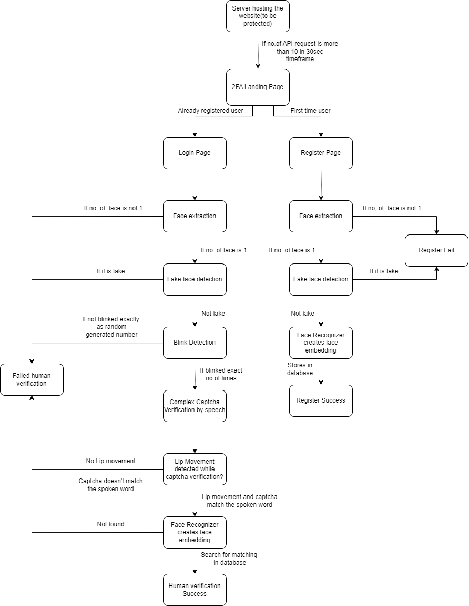

# Enhanced layer of protection against DDoS attack

This project is to build an Enhanced layer of security against DDoS attack using Face and Speech recognition built in React and Flask.

## Objective of the work

Done as part of final year project.
The core idea behind this work is to protect websites from DDoS attacks which can help us to protect from the outage of essential services by overloading the server. To protect efficiently I am making use of face recognition by ruling out fake faces by CNN model and various motion detection and generating complex captcha and verifying the captcha using a speech recognition system to validate the user in case the number of requests within the specific time frame exceeds for accessing the site. Implemented the algorithms in Python and hosted in the backend using Flask and UI is developed using React.js.

## Work Flow

## How to run?

To install frontend packages, go to ddos_auth_frontend, and run command "npm install" (Need to be done once)  
To run the frontend, go to ddos_auth_frontend, and run command "npm start"  
To run the backend, go to ddos_auth_backend, run command "python main.py"
